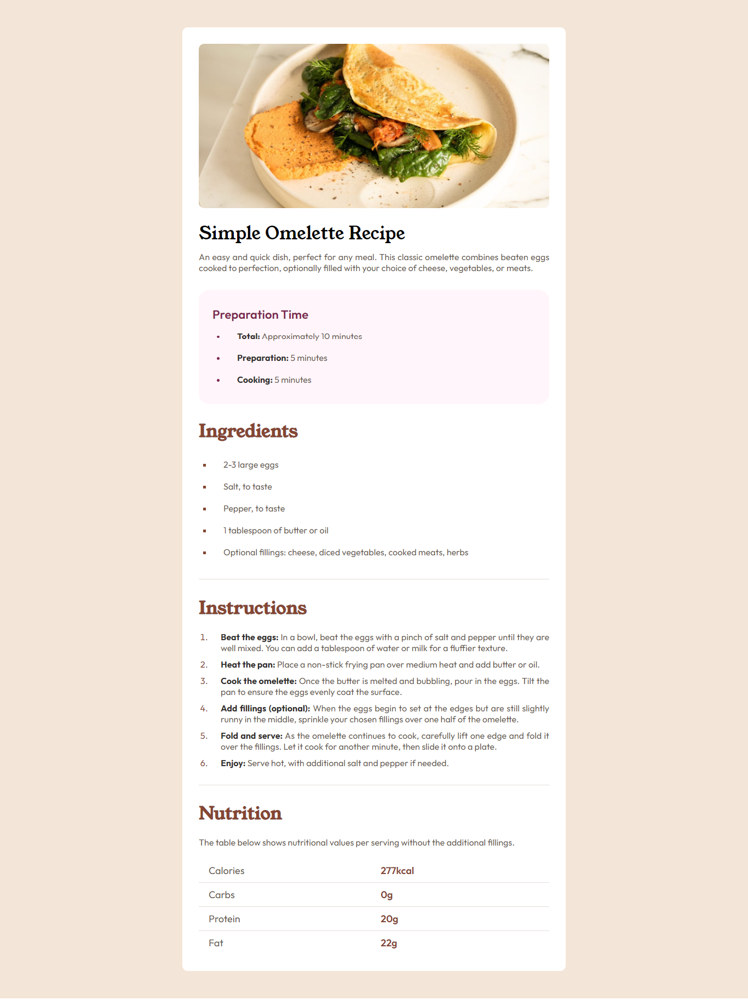

# Frontend Mentor - Recipe page solution

This is a solution to the [Recipe page challenge on Frontend Mentor](https://www.frontendmentor.io/challenges/recipe-page-KiTsR8QQKm). Frontend Mentor challenges help you improve your coding skills by building realistic projects. 

## Table of contents

- [Overview](#overview)
  - [The challenge](#the-challenge)
  - [Screenshot](#screenshot)
  - [Links](#links)
- [My process](#my-process)
  - [Built with](#built-with)
  - [What I learned](#what-i-learned)
  - [Continued development](#continued-development)
- [Author](#author)

### Screenshot

### Links

- Solution URL: [https://github.com/ZarirulIslam/FrontEndRecipeProject]
- Live Site URL: [https://zarirulislam.github.io/FrontEndRecipeProject/]

## My process

### Built with

- Semantic HTML5 markup
- CSS custom properties

### What I learned

I revised my HTML and CSS Knowledge.

### Continued development

I want to solve more challenge.

**Note: Delete this note and the content within this section and replace with your own plans for continued development.**

## Author

- Frontend Mentor - [@ZarirulIslam](https://www.frontendmentor.io/profile/ZarirulIslam)
